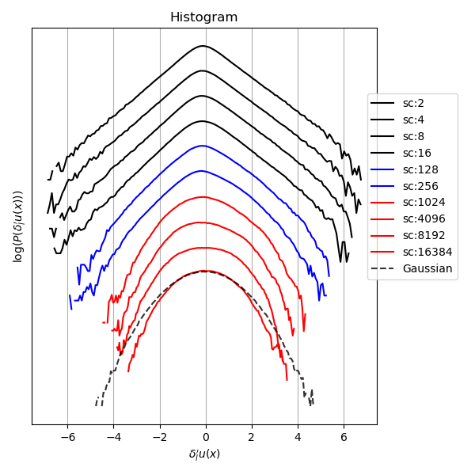
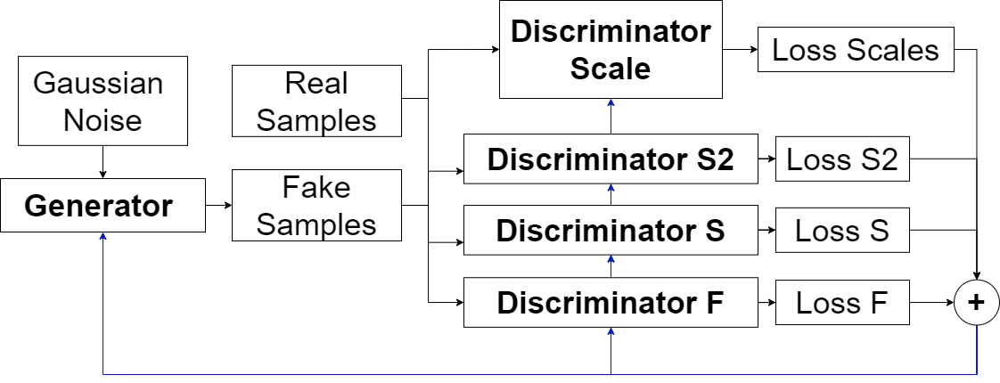

# DCGAN-turb     
Implementation of dense convolutional GANs to generate 1D turbulent velocity signals using a multi discriminator approach.

    
    

# Model usage

# Results
Here are shown the structure function s2, flatness and skewness of the real and the generated samples. As we observe the results are really good in the inertial and integral domains but the results are not yet optimal in the dissipative domain. 

  
  

  <em>Real samples (left) and fake generated samples (right)</em>

  
  

  
  

  <em>Structure functions and histogram of the increments</em>

# Training scheme 

The generator used is a dense convolutional Unet with 5 residual connections. The discriminators were 3 dense nets for the s2, skewness and flatness and one big CNN composed of three individual parts for different sections of the same sample for the scales discriminator. 

  

  

# Loss evolution

  
  

  
  

  
  

